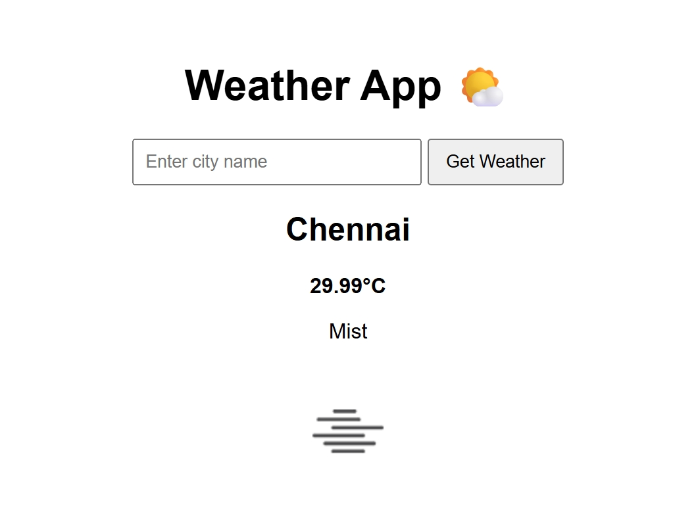

# 🌤️ Weather App

A simple **Flask-based Weather Application** that shows real-time weather information for any city using the **OpenWeatherMap API**.

---

## 📸 Project Screenshot


---

## ✨ Features
- 🌍 Search weather by city name  
- 🌡️ Shows temperature in Celsius  
- ☁️ Displays weather condition (clear, cloudy, rainy, etc.)  
- 🖼️ Weather icons for better visuals  
- ⚡ Built with **Python, Flask, HTML, CSS**  

---

## 🛠️ Tech Stack
- **Backend**: Python, Flask  
- **Frontend**: HTML, CSS (Jinja2 templates)  
- **API**: OpenWeatherMap  

---

## 🚀 Getting Started

### 1️⃣ Clone the repository
```bash
git clone https://github.com/<your-username>/weather-app.git
cd weather-app
